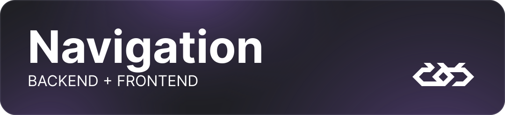

# BLINK

The Blink project 👀 is a Decentralized Communicator, that aims to leverage [WEB3 technology](#web3) and provide easy
access and
communication with people around the world 🗺️ Written in [Rust
🦀](https://github.com/rust-lang/rust), [Vue.js+TS](https://github.com/vuejs/core), [Pinia](https://github.com/vuejs/pinia)
🍍
and [TailwindCSS](https://github.com/tailwindlabs/tailwindcss) 🍃 with the [Dfinity
CDK](https://github.com/dfinity/cdk-rs) for compiling.

### About

The goal is to create innovative solutions in digital services, data security, scalability, and
interoperability.

<p id="web3"></p>
Web3 is an idea for a new iteration of the World Wide Web which incorporates concepts
such as decentralization, blockchain technologies, and token-based economics.

Our challenge is to develop a canister on the Internet Computer that addresses one or more problems
described in the
contest project. We have chosen to create a DApp with a communication system.

### Requirements (Met!)

- [x] A public project on GitHub with complete code
- [x] A detailed project description in the README file
- [x] A short presentation of the idea (maximum 3 minutes)

> _Build a Layer 2 application for Bitcoin and/or Ethereum using ICP functionalities to provide solutions beneficial to
the
Bitcoin and Ethereum ecosystems in Europe. This could include innovative financial services, cross-border transactions,
secure storage solutions, or applications that interact with other blockchains using Chain-key signatures and retrieve
data from RPC nodes. The only limitation is your hardware._

### Version

First release 1.0.0-BETA

> [!Caution]
> Project is still under a development

If you encounter any bugs or errors, create an issue and head to the [Security section](#security)

<p id="navigation"></p>



| Section      | Topic                                                        |
|--------------|--------------------------------------------------------------|
| Summary      | [Short summary of the project](#blink)                       |
| Technologies | [What we've used](#technologies)                             |
| Setup        | [How to host one yourself](#setup)                           |
| Interface    | [Navigation inside the App](#interface)                      |
| Service      | [What's happening under the hood?](#service)                 |
| Authors      | [See who created this masterpiece](#authors)                 |
| Contributing | [Join us and create a better user experience](#contributing) |
| License      | [Want to use our codebase for work?](#license)               |
| Security     | [Learn more about our code vulnerabilities](#security)       |

<p id="technologies"></p>


For our backend service we have chosen **Rust** 🦀 as Message provider with it’s memory safety and blazingly fast 🚀
computing.

In creating interface **TypeScript** and **Vue.js** helped us the most, with addition of TailwindCSS for styling and
Vite,
Docker for deployment, so we can launch our project to at any time!

<p id="setup"></p>


### Deployment

```sh
dfx start
```

```sh
dfx deploy
```

<p id="interface"></p>


### [Messages](./src/views/MessagesView.vue)

This section provides features to search for users, view currently online users, and browse through recent open
chats.

### [Chat](./src/views/ChatView.vue)

Here, the entire application process takes place, including the exchange of messages and images.

### [Discover](./src/views/DiscoverView.vue)

This section allows users to find new people that want to communicate.

> [!WARNING]
> Work-in-progress Feature

### [Settings](./src/views/SettingsView.vue)

This option enables users to personalize the application's appearance and behavior to suit their daily usage
preferences and needs.

> [!WARNING]
> Work-in-progress Feature

<p id="service"></p>


### Storage

Because blockchain is immutable by default we need to ensure data integrity during contract upgrades by using stable
storage. This also allows to reliably save data on the blockchain. Ensures that the contract can always be brought back
to a known good state.

<p id="authors"></p>


<p align="center">
    <a href="https://github.com/botprzemek">
        
    </a>
    <a href="https://github.com/Braspi">
        
    </a>
    <a href="https://github.com/ponurakk">    
        
    </a>
</p>

<p id="contributing"></p>


> I would like to join this list. How can I help the project?

We're currently looking for contributions for the following:

1. Bug fixes and penetration
2. Refactors
3. Configs improvements
4. Ideas (even if we already have a ton to implement)

<p id="license"></p>


This project is licensed under the Apache License, Version 2.0. Key points are: permissions and conditions of usage. For
more detailed information, please refer to the [LICENSE file](./LICENSE)

<p id="security"></p>


To learn more about project versions see [SECURITY.md](./SECURITY.md)


<p align="center">
    Thanks for reaching the bottom!
    <a href="#navigation">Go back to the top</a>
</p>