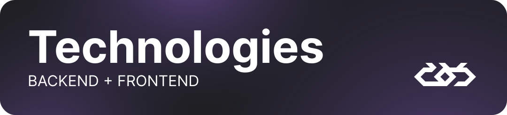
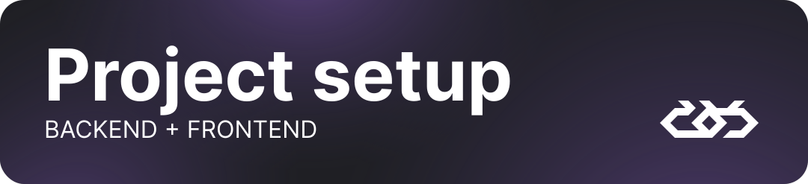
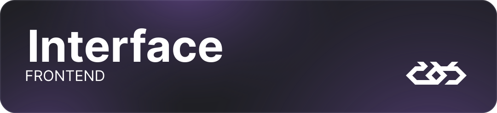
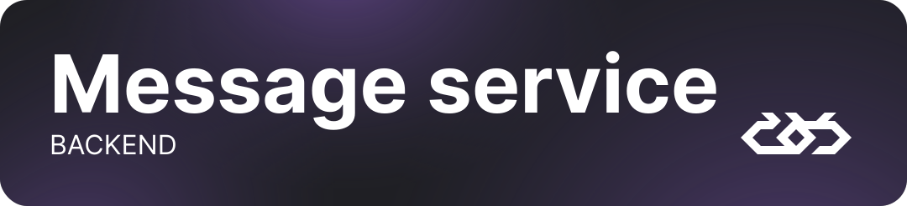
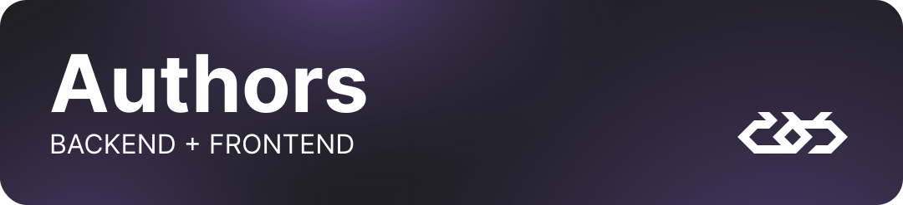
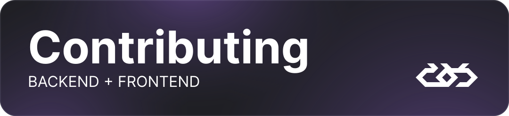
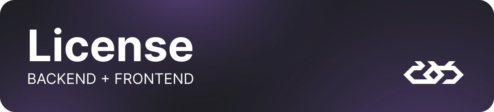
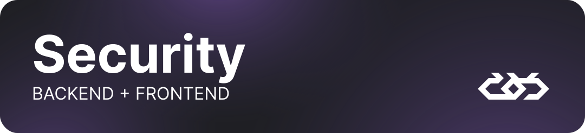

The Blink project aims to leverage web3 technology and provide easy access and communication with people around the
world 🗺️.

about
version
state




For our backend service we have chosen **Rust** 🦀 as Message provider with it’s memory safety and blazingly fast 🚀
computing.

In creating interface **TypeScript** and **Vue.js** helped us the most, with addition of TailwindCSS for styling and
Vite,
Docker for deployment our project is ready to launch at any time!



development
deployment

[VSCode](https://code.visualstudio.com/) + [Volar](https://marketplace.visualstudio.com/items?itemName=Vue.volar) (and
disable Vetur).

## Type Support for `.vue` Imports in TS

TypeScript cannot handle type information for `.vue` imports by default, so we replace the `tsc` CLI with `vue-tsc` for
type checking. In editors, we need [Volar](https://marketplace.visualstudio.com/items?itemName=Vue.volar) to make the
TypeScript language service aware of `.vue` types.

> [!Caution]
> <span id="status">Project is still work in progress</span>

## Customize configuration

See [Vite Configuration Reference](https://vitejs.dev/config/).

## Project Setup

```sh
npm install
```

### Compile and Hot-Reload for Development

```sh
npm run dev
```

### Type-Check, Compile and Minify for Production

```sh
npm run build
```

### Run Unit Tests with [Vitest](https://vitest.dev/)

```sh
npm run test:unit
```

### Lint with [ESLint](https://eslint.org/)

```sh
npm run lint
```



messages

This section provides features to search for users 👥, view currently online users, and browse through recent open
chats.🧑‍💻

settings

This option enables users to personalize 🎨 the application's appearance and behavior to suit their daily usage
preferences ⚙️ and needs.

conversation

Here, the entire application process takes place, including the exchange of messages📱, photos 📷, and voice recordings🎙.



storage

Because blockchain is immutable by default we need to ensure data integrity during contract upgrades by using stable
storage. This also allows to reliably save data on the blockchain. Ensures that the contract can always be brought back
to a known good state.




Responsible for design and Frontend are Jeremiasz and Przemek 🌐, while Maks handles the backend. 🖥️



See CONTRIBUTING.md



Apache 2.0



This template should help get you started developing with Vue 3 in Vite.